# Message Queuing Telemetry Transport

- **Author**: *Anthony Narlock*
- **High-level description**: Publish-subscribe based messaging protocol utilizing TCP client-server sockets in Python. This program has been tested on Windows 11, Linux Ubuntu, and macOS Monterary. This project was created for the CSCI 4211 - Introduction to Computer Networks class in Fall 2022. Given was only a description of the application features and the requirement of a multi-threaded server that can support many clients. All of the code and documentation for this project was created by me (Anthony Narlock).

## Architecture
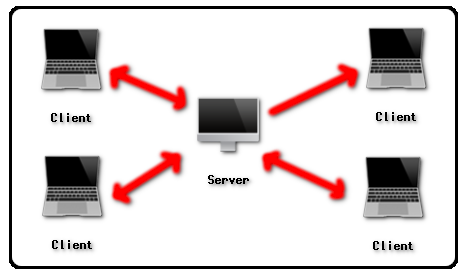

## Features
| Feature | Description | Message Format | Client Command |
| ------------- | ------------- | ------------- | ------------- |
| CONNECT | Clients can connect to a server and exchange messages with it. This message will be sent from client to server after the socket connection is established. | Client: `<CONN>`   SERVER: `<CONN_ACK>`| |
| DISCONNECT | When clients disconnect from a server, they need to notify the server and wait for the server to respond to the disconnect request. The server must respond with an ACK to the request before closing the socket. Clients can safely close the socket after receiving the response from the server. | Client: `<DISC>`   SERVER: `<DISC_ACK>`| `/DISC` |
| PUBLISH | Clients can send request to publish messages to any topic. The server handles the publish request and distributes the message to the subscribed clients. A client serves both as a subscriber and a publisher. A client can only publish to a topic that they are also subscribed to. For *retaining* a message, the client can use the `/PUBR` command, which will retain the message so when a new client subscribes to a topic, they will receive the retained message. | Client: `<PUB, TOPIC, MSG>` | `/PUB <TOPIC> <MESSAGE>`   `/PUBR <TOPIC> <MESSAGE>` |
| SUBSCRIBE | Clients can send requests to subscribe to topics they are interested in. The default topics for this project are WEATHER, NEWS, HEALTH, and SECURITY. | Client: `<SUB, TOPIC>`   SERVER: `<SUCCESS>`   or SERVER: `<ERROR>` | `/SUB <TOPIC>` |
| UNSUBSCRIBE | Clients can unsubscribe from a topic. The server should return the topics unsubscribed to or an error if the client has not subscribed to such topic. | Client: `<UNSUB, TOPIC>`   SERVER: `<SUCCESS>`   or SERVER: `<ERROR>` | `/UNSUB <TOPIC>` |
| LIST | Clients can use this command to query the topics that they have subscribed to. The server will send a list of topics and the number of topics they have subscribed to. | Client: `<LIST>`   SERVER: `<Number of topics, TOPIC, TOPIC, ...>`| `/LIST` |

## How to build/run this project
### Requirements
- Python 3.9+
- Knowledge of how to run python programs. Depending on your installation, you may be able to launch each program using `./server.py`, `py server.py` or `python3 server.py`. It is required that you understand which you need to do for launching python programs.
### Running the program
- In order for a client to connect to the server, the server must be started. You can start the server by running the `server.py` program. You will run this using your python interpreter on the command line. Please refer to the requirements if you do not have knowledge of how to run python programs.
- Upon launching the server program, it is important to notice that the host is `localhost` and the default port that the server is running on is `8092`. You are able to change this port by editing the `server.py` file. However, you will need to do this for the `client.py` file as well or else the client will never be able to connect to the server.
- Once the server is launched, you will the message `Server is listening on port 8092`.
- In separate terminals, we can have clients connect to the server. To start a client program, open a new terminal and run the `client.py` program in the same way you did the server program. Assuming your ports are setup, you will see that the connection acknoledgement message was received from the server to the client - you are ready to start subscribing and publishing! If the server is not running or on an incorrect port, the client will fail to connect to the server. An error will be displayed describing this issue. Please note that there are no command line arguments for this program, meaning that if you wish to change the hosting port and connecting port, you will need to modify `server.py` and `client.py` respectively.

## How the features were implemented
- The **client** can send and receive messages concurrently. This means that we have a thread dedicated for sending messages, `write()`, and we have a thread dedicated for receiving messages, `receive()`. The client can utilize the `write()` thread to input commands to the server.
- The **server** can handle many clients. It contains a dedicated `handle()` which runs on a thread for each client. This thread will receive the input commands that are sent from the client's input. This is how all of commands above are handled.
- The commands for clients for each feature is described in the Client Command column of the Features table above. In the following section, I provide a brief explanation of how each of these is handled by the server.

## Client commands and implementation details

### Client Connection
`Client Connection` is handled automatically when the client program runs. If the server is offline, then the client will receive a message indicating that they were unable to connect to the server. On success, the client will be sending the CONN to the server, which will respond with the CONN_ACK and send it back to the client - this indicates that the client is successfully connected to the server. The following screenshots shows a demonstration of this feature. Please note that the left-hand side is the server program and the right-hand side is a single client program.

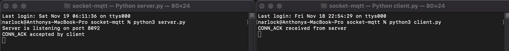

Under the condition where the user of the application has modified the `client.py` file such that it does not connect to the port that the server is on. The following message will be shown to the client to handle this.

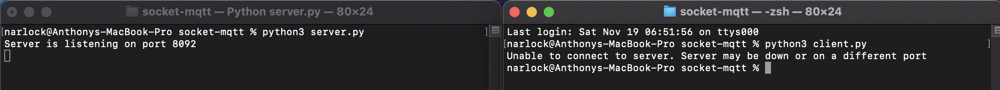

### Client Disconnection
`/DISC` disconnects a client from the server. It will send the DISC message to the server. The server will acknoledge that the client wants to disconnect, it will send acknoledgement back to the client: DISC_ACK, and then will then disconnect from the client's socket. The client will receive DISC_ACK, and a message will be printed displaying it is safe to disconnect. The client will hit enter and the application will close.

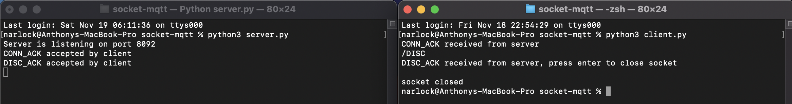

### Client Subscribing
`/SUB <TOPIC>` will subscribe a client to a topic. The client will send this command and the server will add the topic to the client's list of subscriptions. The server will then send a message indicating that the client has successfully connected to the server. Under an invalid input of the command, such as invalid topic name, a message will be sent to the client indicating they misused the command. The following image shows a client subscribing to the WEATHER topic.

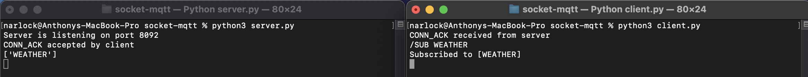

The following image shows a client subscribing to a *new* topic. If the topic does not exist, the user can create a single-level or multi-level topic by subscribing to the topic. The following shows an example of a client subscribing to new topics. The server will display all of the topics when a new topic is created.

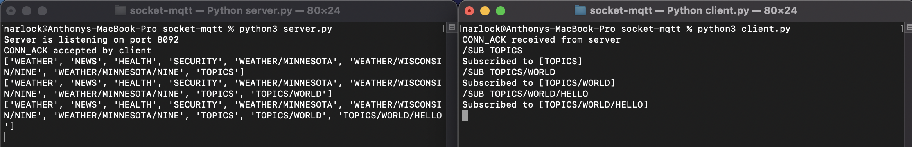

The following image utilizes the **multi-level wildcard**. This will subscribe the client to each of the matching topics. Note that if the client is already subscribed to a topic in the matching, this topic will be ignored. If no topics match the multi-level wildcard, the client will recieve a message `"No topic matches for <TOPIC>."`. This is because the separators are used specifically for matching existing topics. The following images shows both invalid multi-level subscription and valid multi-level subscription.

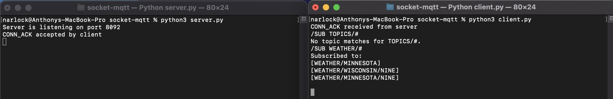

The following image utilizes the **single-level wildcard**. This will subscribe the client to each of the matching topics. Note that if the client is already subscribed to a topic in the macthing, this topic will be ignored. If no topics match the single-level separator, the client will receive a message `"No topic matches for <TOPIC>."`. 
This is because the separators are used specifically for matching existting topics. The following images show both invalid sinlge-level subscription and valid single-level subscription.

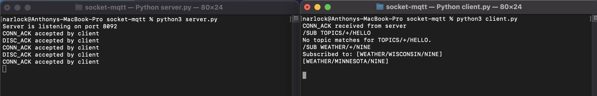

### Client Publishing
`/PUB <TOPIC> <MESSAGE>` will publish a client's message to a topic. When the server receives a valid publish command, the server will call the `broadcast()`, passing in the topic name and the client's message. This will send the message to each of the clients that are subscribed to the topic. Under an invalid input of the command, such as invalid topic name, a message will be sent to the client indicating they misused the command. A client may only publish a message to a topic in which they are subscribed to.

The following image contains the server program (top-left) and three client programs that are connected to the server. The client in the top-left has subscribed to the WEATHER topic, the client in the bottom-right has subscribed to WEATHER/MINNESOTA, WEATHER/WISCONSIN/NINE, and WEATHER/MINNESOTA/NINE, and the client in the bottom-left has subscribed to WEATHER/MINNESOTA/NINE and WEATHER/WISCONSIN/NINE. The important things to notice about this image is that when the client in the top-left publishes a message to the WEATHER topic, neither client on the bottom of the image receive the published message because neither of them are subscribed to the WEATHER topic. Now, we can see that when the client in the bottom-left publishes a message to the WEATHER/MINNESOTA/NINE topic, both the client sending the message and the client in the bottom-right will receive the published message from the topic. This is because both of the clients are subscribed to that topic. Finally, the client in the bottom-right can publish a message to the same topic and both clients on the bottom of the image will receive the published message.

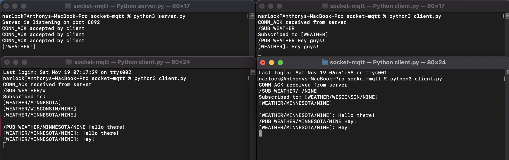

The next images show the publish feature being used utilizing **level-wildcards**. The first image shows the client in the bottom-left publishing a message utilizing multi-leveled topic. All of the topics will broadcast the message the user types. The second image shows the client in the bottom-right publish a message utilizing single-level topic. all of the topics will broadcast the message the user types.

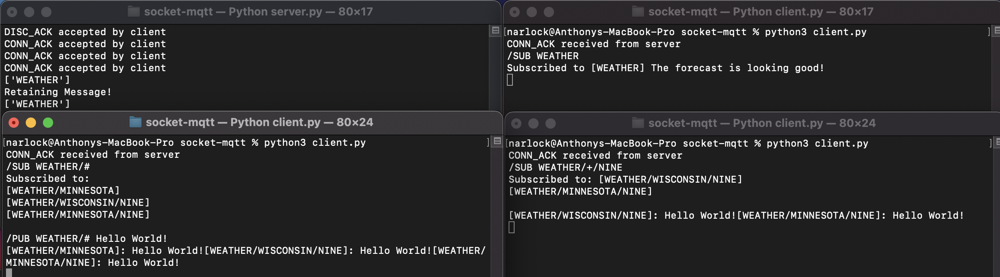

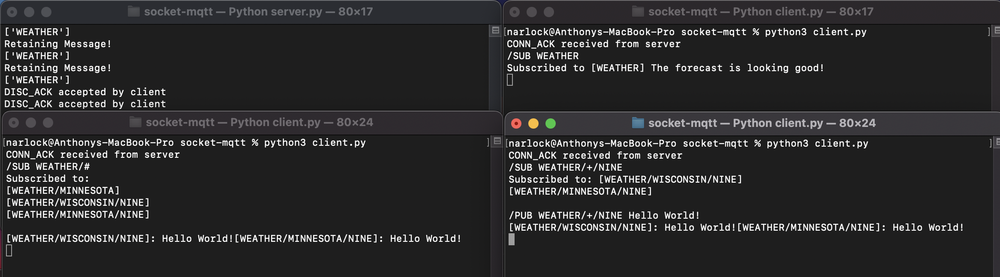

#### Retaining Published Message
`/PUBR <TOPIC> <MESSAGE>` will take similar action to `/PUB`, except the message will be *retained*. This means that when a new client subscribes to a topic, they will receive the retained message. 

The following image demonstrates another multi-client interaction on the server and demonstrates the functionality of retaining published messages. The client in the bottom-left first subscribes to the WEATHER topic and publishes (with the retain identifier) a message "Hello world!" to the topic. Next, the client in the top-right subscribes to the WEATHER topic and receives the retained message in that topic. The top-right client then uses the same command that publishes and retains the message "The forecast is looking good!". Finally, the client in the bottom-right subscribes to the WEATHER topic and receives the new retained message.

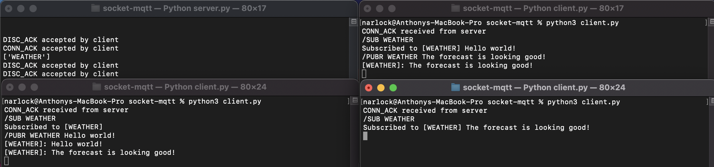

Likewise with regluar publishing, the user can use **level-wildcards** to retain the same message to matching topics. The first image demonstrates this with the multi-level wildcard and the second image demonstrates this with the single-level wildcard.

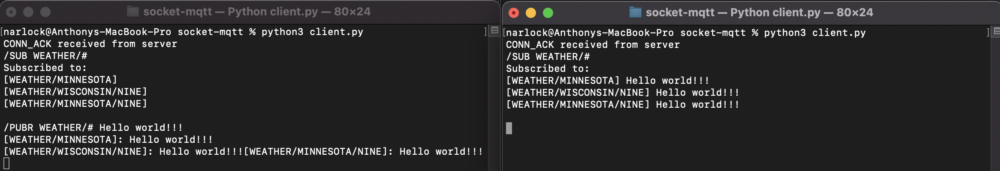

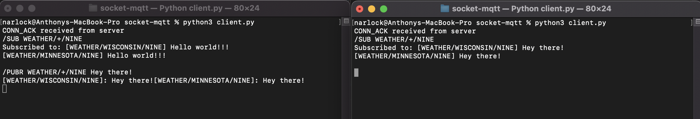

### Client Unsubscribing
`/UNSUB <TOPIC>` will unsubscribe a client from a topic. The client will need to be already subscribed to the topic for this to work. The sevrer will respond indicating that the client is not subscribed to the topic if they are not. If they are, the server will unsubscribe them from the topic and send the client a message. The following image shows a simple example of a client unsubscribing from a topic.

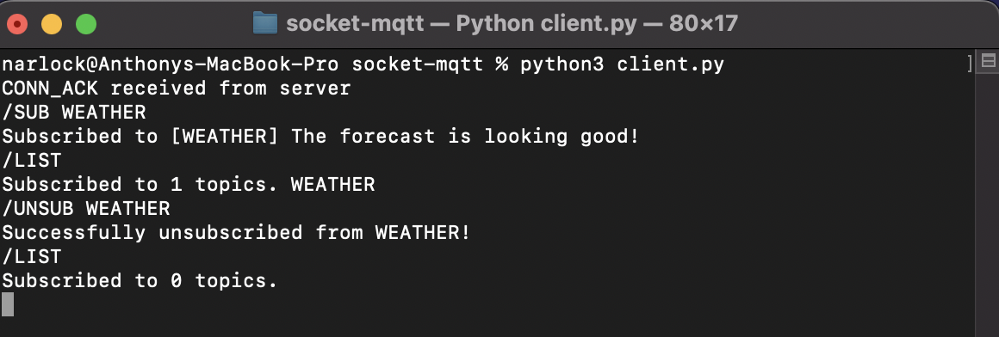

The following two screenshots demonstrate this using the **level-wildcards**. The first image shows unsubscribing on topics that match the multi-level wildcard, and the second image shows unsubscribing on topics that match the single-level wildcard.

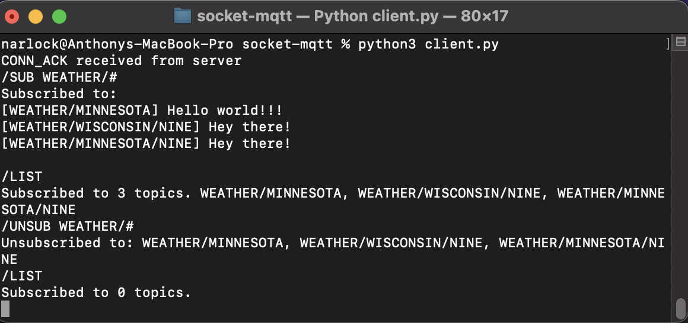

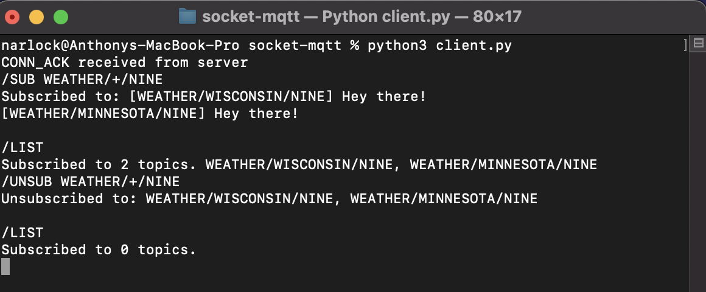

### Client List of Subscribed Topics
`/LIST` will query the amount of topics the client is subscribed to along with the names of the topics they are subscribed to.

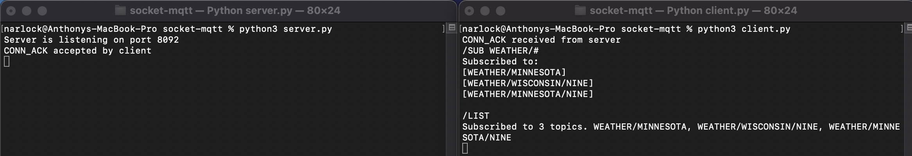

If the client is subscribed to zero topics, the server will put zero as the amount of topics subscribed.

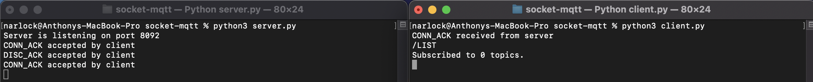

### Leveled-topics
- The following section has already been mentioned in terms of how to use the leveled-topics. This section gives another brief description of the leveled topics.
- Topics have the ability to contain multiple levels. That is, the topic `WEATHER` may have *sub topics* such as `WEATHER/MINNESOTA` or `WEATHER/WISCONSIN`. These sub topics can also have sub topics such as `WEATHER/MINNESOTA/MINNEAPOLIS`, `WEATHER/MINNESOTA/STPAUL` or `WEATHER/WISCONSIN/GREENBAY`, `WEATHER/WISCONSIN/MADISON`.
- The client can use **multi level wildcard** */#* and **single level wildcard** *+* to query more than a single topic and perform some action on multiple topics.
- These topics can be accessed or called so that multiple operators can be performed in one command. For example, if there were three topics that matched to `WEATHER/#`, then that command would be performed on each of those topics. There are obviously exceptions. For instance, if the user does `/SUB WEATHER/#`, and they are already subscribed to `WEATHER/MINNESOTA`, then they will be subscribed to all of the other matched topics.

### Invalid Command
Any other command is handled by the server as an "invalid command" - the server will respond to the client indicating they did not enter a valid command.

Additionally, if the client attempts to use a valid command but they misuse the syntax of the command, they will get a message indicating that they had invalid syntax in their command.
